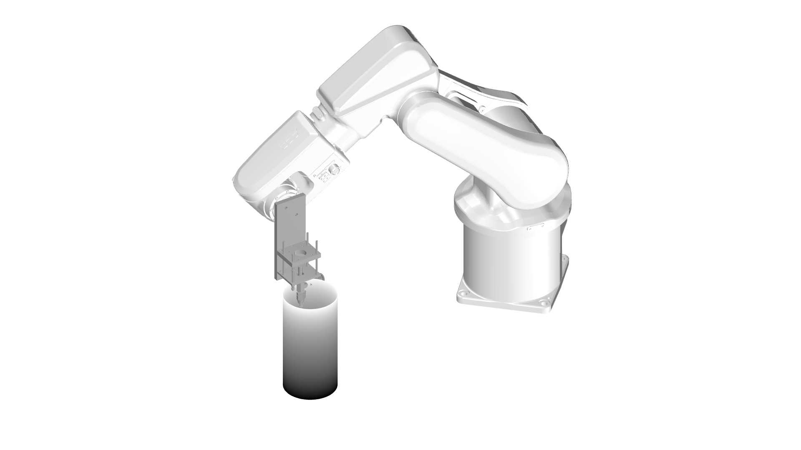
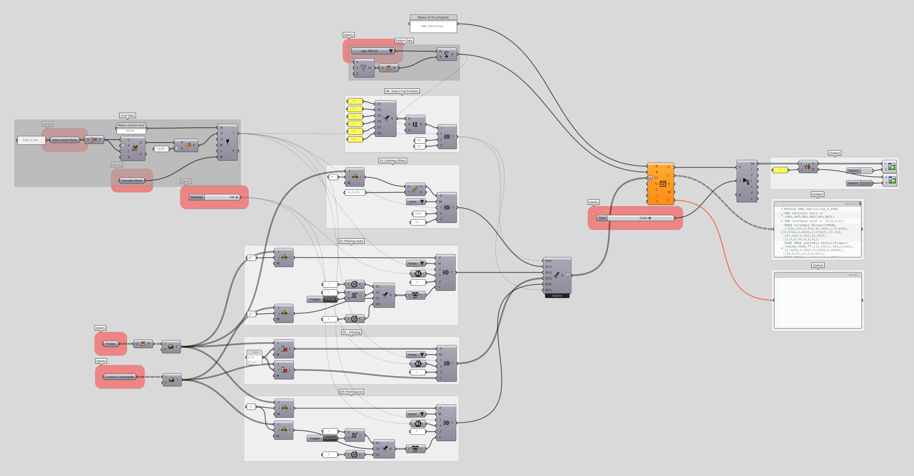

## Robotic_Extruding

The following code generates robot program for extruding material using a robotic arm, Optionally you can assign material proportion values for each point (from 0 to 1) to print double materials.

## Inputs:

| Name          |Description     | Type  |
| ------------- | -------------- | ----- |
| Points    | Points to be used for robotic path planning | point3d |
| Command (Optional)    | Custom command for ABB robots on Robots Plugin | command(C) |
| Robot System | Name of the robot system | string |
| Tool Plane | Tool Center Plane | plane |
| Tool Geometry | a Mesh defining Tool Geometry | mesh |
| Speed | printing speed mm/s | number |
| Zone | zone parameter | number |
| Time | Advance the simulation to this time | number |

## Outputs:

| Name          |Description     | Type  |
| ------------- | -------------- | ----- |
| Code  | G-Code for Robot | string |
| Robot Mesh | Robot system mesh for visualization | mesh |
| Errors | Possible errors in the robot program | string |

## Description:

### Prerequisites

> [Rhino 5](https://www.rhino3d.com/download/rhino/5/latest) + [Grasshopper](https://www.grasshopper3d.com/page/download-1) / [Rhino 6](https://www.rhino3d.com/download)  
> [Robots plugin for Grasshopper](https://github.com/visose/Robots)

## Authors

## Acknowledgments
